## DragonBallZ  
The project is a dragonballz game developed using Greenfoot IDE.

#### Basic Game Play
Make Goku collect all 7 dragonballs to make shenron grant him a wish. Do this while evading 3 of Goku's enemies.

#### Game Screenshots
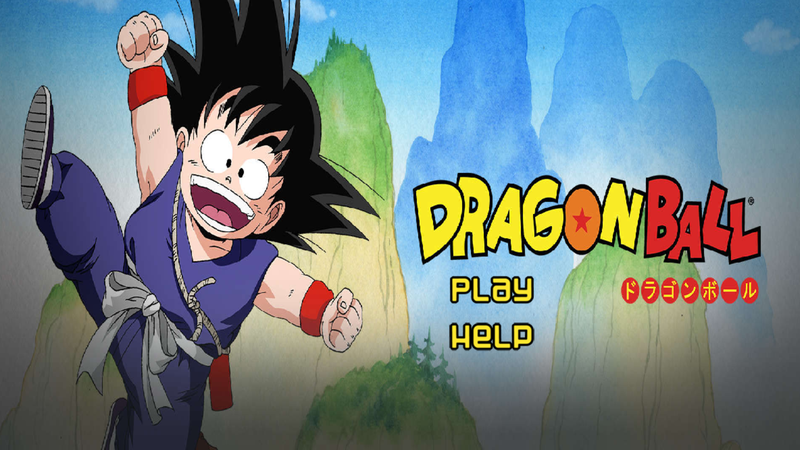  

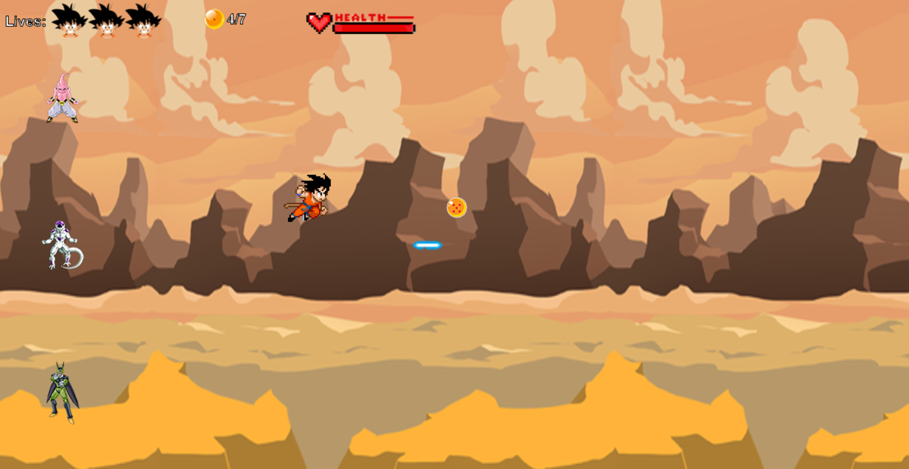  

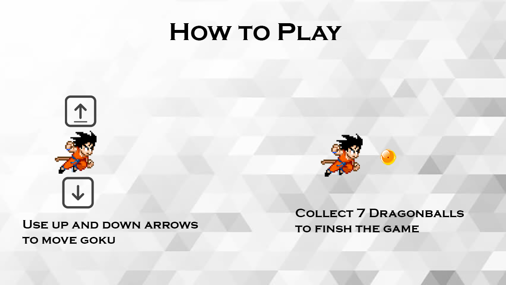

### Running the game

#### Starting the server

The following are the procedures to start the server locally.

Requirements : 
1. python3
2. Flask
3. flask-restful

Use `python3 server/server.py 5000` to start the server.

The actual game server has been hosted on AWS EC2 and the game by default connects to this instance.

#### Starting the game
1. Clone the repo and use Greenfoot IDE to run the game and make modifications.

### UML Documentation

#### User Options
1. The player gets to choose his username and then start the game or use the help option to understand controls.
2. User can use the up/down arrow keys to move the main character(Goku) in a manner that will let him collect dragonballs while avoiding the powerups his enemies throw at him.
3. The player is rated on how fast he can complete and game and get shenron's wish.

#### Use Case Diagram

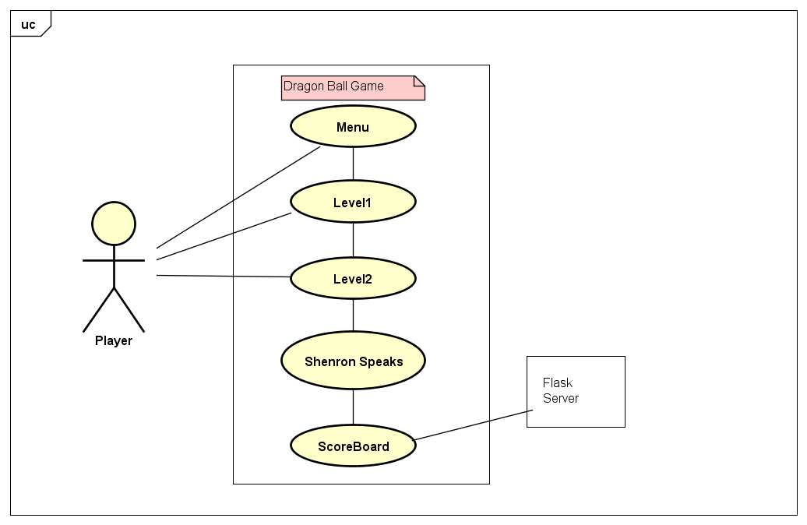

#### Class Diagrams for Design Patterns used

##### Command Pattern

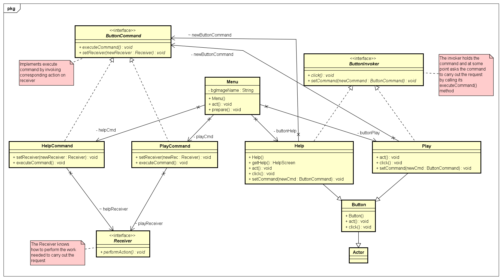

##### Chain Of Responsibility

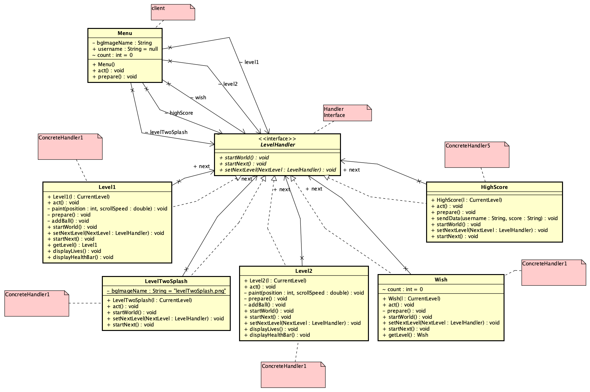

##### Iterator Pattern

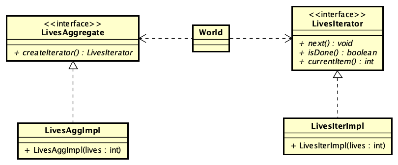

##### Observer Pattern

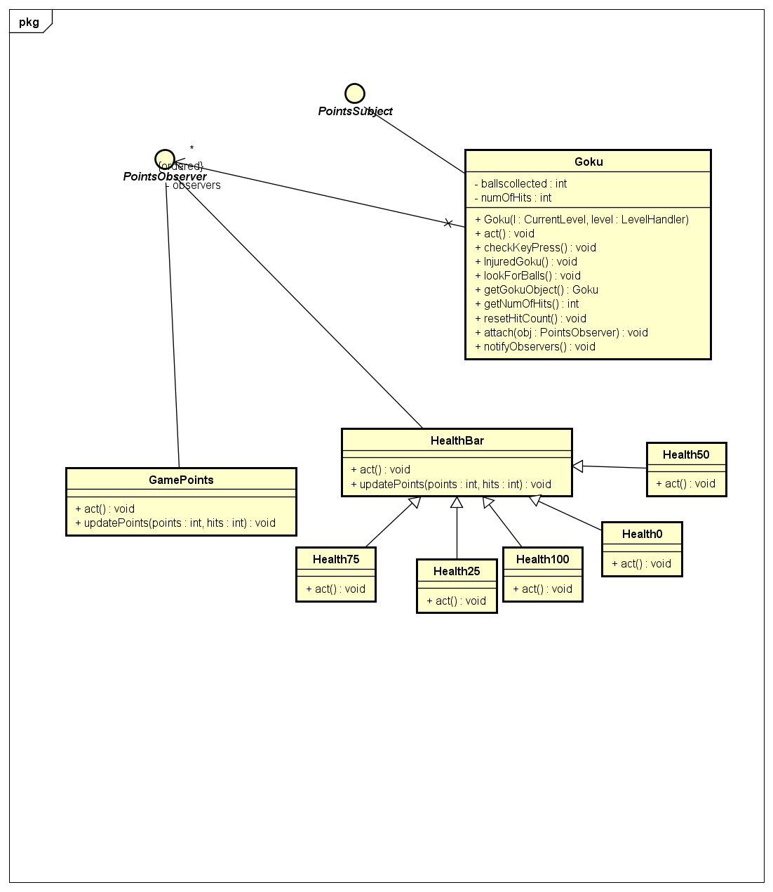

#### Sequence Diagram

##### Movement between Levels (worlds)

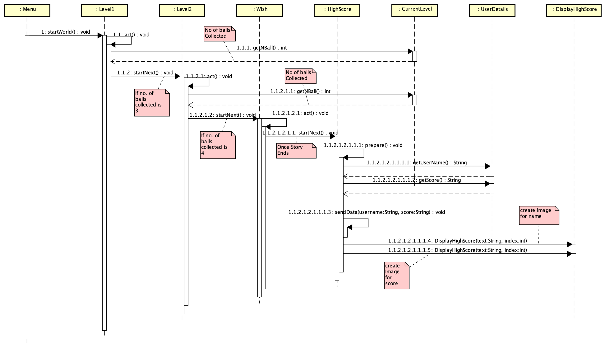

##### Keeping track of lives lost

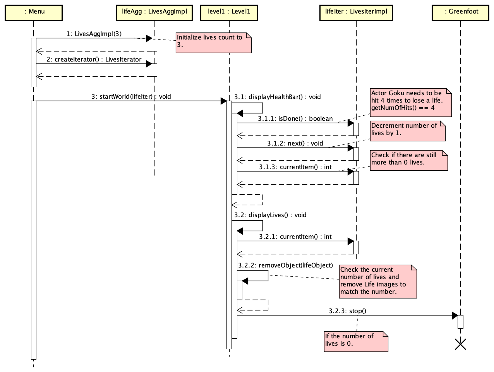

#### Activity Diagram
To give overview of gameplay flow.

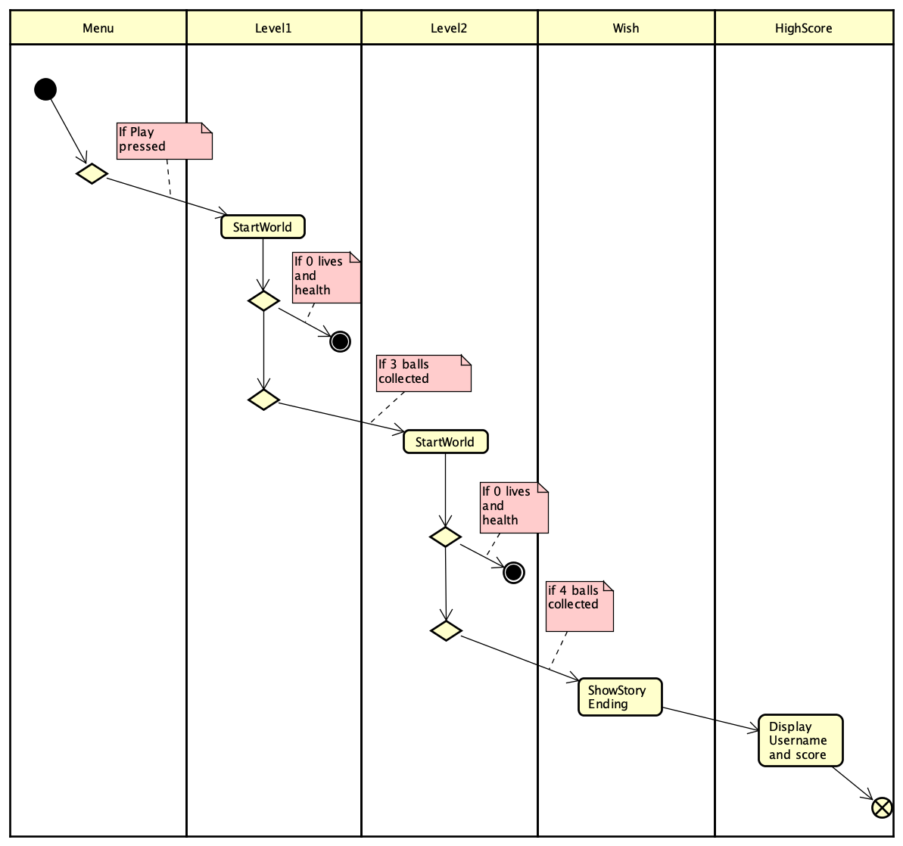
